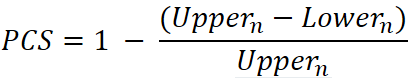
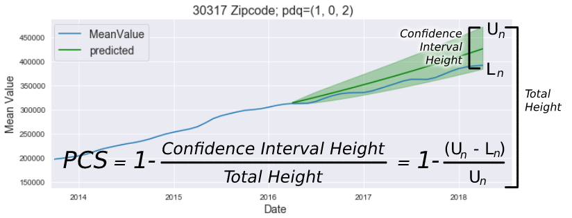

# Module 4 -  Final Project Specifications

## Introduction

For the module 4 project, I was tasked with identifying the "best" 5 zipcodes for investing in houses (by an investment firm, not homeowners) within a region of my choice. Here, I have defined "best" as being the zipcode that strikes the best balance between return on investment (ROI) and volatility of house prices. 

## Overview

For those who are interested, the Jupyter Notebook containing all of the code for this project can be found here:
* [Atlanta housing notebook](Atlanta_housing.ipynb)

The region selected for this project was the greater metro area of Atlanta, Georgia. This region was chosen because this project's author is intimately familiar with the area, having lived there for 30 years, which ought to facilitate forming insights about the data and models for the region. 

Additionally, because the project was intended for use by an investment firm and not by potential homeowners, the forecast time horizon was set rather short (2-year projection) to reflect the desire for a quicker ROI. 

One final nuance was the decision to account for the 2008 housing crash. This crash made housing prices across the United States plummet universally. As a consequence, many neighborhoods experienced a rash of foreclosures while others did not. Such an event logically creates the potential to disrupt and reorient previous trends. Therefore, date of 2012-01-01 was chosen as a Day 0 for this project as it is fairly close to the date when the US housing market is known to have bottomed out and begun its slow crawl to recovery.

## Methodology

After preprocessing the data, a brief initial EDA was done to reveal overall trends. As expected, the period 2008-2011 was one of universal decline. To account for this all dates prior to 2012 were filtered out.

I next selected a single zip code (30342) to log-transform and decompose in order to check for trends, seasonality, and stationarity of its residuals. The interesting aspect of this test's results were that an examination of the y-axis of the seasonality graph suggested that the data does not, in fact, exhibit significant seasonality. Consequently, this permitted me to develop a simpler ARIMA model that ignores seasonality (much more time efficient, thankfully).

Then I developed an ARIMA model using the `SARIMAX` method from `statsmodels`. First, I iterated through multiple combinations of (p,d,q) parameters to select the best fit model for 30342, then built the ARIMA model accordingly. This process returned a prediction graph (seen below) that had a somewhat troubling confidence interval cone. The overall trend was positive, but the lower bound of the confidence interval actaully sloped downward from the prediction starting point, suggesting that investing in this zipcode did not guarantee profit. 

Therefore, I decided to iterate through all of the zip codes in the region, using a function to find the best (p,d,q) parameters on a zip code by zip code basis, building an ARIMA model for each. This enabled me to compare the potential ROIs for each zipcode, but did not account for risky confidence intervals. 

To account for volatility (which produces wide confidence intervals in predictions), I created my own metric by which to select the least volatile zipcodes. Dubbed the Parker Confidence Score (PCS), it is calculated as follows:

where ***n*** is the final observation in the prediction, ***Upper*** is the upper bound of the confidence interval, and ***Lower*** is the lower bound of the confidence interval. A PCS close to 1 is ideal. This score makes it possible to compare the tightness of confidence interval spread between different models. You can see below an example of a model with a good PCS score.

I then filtered all Atlanta zip codes to find those with a PCS greater than .8, and from those finally selected the five zip codes with the highest ROI.

## Results

I highly recommend purchasing real estate in the Atlanta zipcodes of 30317, 30030, 30341, 30087, and 30319 which correspond to the areas of Kirkwood, Decatur, Chamblee, Rockbridge, and Brookhaven, respectively. Based on the modeling work, I have concluded that if an investment firm were to buy a house of mean value in each of these zip codes, you would most likely see a minimum 2-year return on investment of 7-21%, a maximum 2-year ROI of 27-48%, and an average 2-year ROI of 18-34%. That's pretty good.

